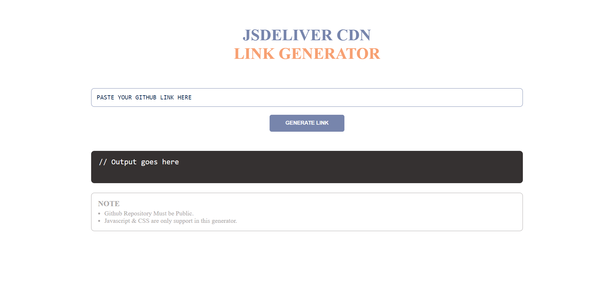

# Generate CDN Link JSDeliever

This is the project of cdn generating from github repository. Javascript and CSS only supported.

---
## Table Of Contents

  - [Project Showcase](#project-showcase)
  - [Technology](#technology)
  - [How to use](#how-to-use)
  - [Credits](#credits)

---

## Project Showcase

---

## Technology
  - HTML
  - CSS
  - Javascript
---

## How to use

> Note: Private repository file cdn link not work.

  - Copy the file link
  - Paste into the **textbox**
  - Click on **Generate Link**
  - Copy link using **copy button**

---

## Credits

[Anil Oli](https://github.com/anilioli42) (FrontEnd Web Developer)